# 프로젝트명 : gameR makeR (남청하)  

# [ 목차 ]
### 1. [컨셉](#성장)
### 2. [관련 이미지와 동영상](#2)
### 3. [대표 이미지 그리고 컨셉과 대표이미지 기반 작품 묘사](#3)
### 4. [gameR makeR의 구성 요소](#4)
### 5. [게임 시스템 디자인](#5)
### 6. [요구사항(6주차)](#6)
### 6. [요구사항(1년차)](#66)
### 7. [키보드 이벤트에 대한 흐름도](#7)
### 8. [용어 정리](#8)
### 9. [개발 작업](#9)
### 10. [1주차 작업 결과](files/w09/index.md)
### 10. [2주차 작업 결과](files/w10/index.md)
### 10. [3주차 작업 결과](files/w11/index.md)
### 10. [4주차 작업 결과](files/w12/index.md)
### 10. [5주차 작업 결과](files/w13/index.md)
### 10. [6주차 작업 결과](files/w14/index.md)

# [컨셉]  
## 메인컨셉 : 성장 타이쿤  

- 프로게이머가 성장해나가는 과정을 담은 게임  

- 프로게이머를 꿈꾸는 캐릭터를 플레이어가 직접 스케줄을 편성하며 육성  

- e스포츠 종목이 아시안 게임 정식 종목으로 채택되며 국가대표를 선발하는 최근 동태를 반영하여 캐릭터의 최종 목표를 국가대표 선발로 잡음  

- 프로게이머 데뷔부터 국가대표 선발까지의 다양한 노력의 과정을 담아 결실을 맺어내는 것이 최종 목표  

### 서브 컨셉 1 : 스케줄 관리  

- 1 ~ 4주차로 구성된 한달의 스케줄을 플레이어가 직접 구성
- 1. 경기 2. 연습 3. 운동, 총 3가지의 행동을 활용하여 스케줄 편성

### 서브 컨셉 2 : 스탯

- 컨디션(HP), 멘탈(MP)로 스탯 구성
- 컨디션(HP) : 스케줄 활동 시에 소모, 휴식이나 식사등을 통하여 회복
- 멘탈(MP) : 랜덤 이벤트 발생 시에 소모, 휴식이나 여행을 통하여 회복

### 서브 컨셉 3 : 재화 및 소비

- 개인 연습을 통하여 재화 획득 : 일정 클릭량에 다다르면 재화 획득
- 방송 스트리밍을 통하여 재화 획득 : 팬 수와 비례하여 획득량 증가
- 소비 아이템(간식 등) 구매를 통하여 재화 소비

### 서브 컨셉 4 : 2D 도트 및 원룸

- 2D 도트 그래픽 직접 제작 예정
- 원룸 구조의 배경으로 카메라(시점) 고정

### 서브 컨셉 5 : 클릭커(Clicker)

- 클릭커 형식으로 진행되는 게임
- 클릭량에 따라 스탯 및 품질 향상 효과

  

# [관련 이미지 & 동영상]  

- 이미지  
  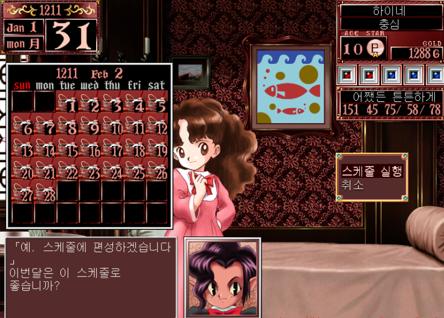

  
- 동영상
  [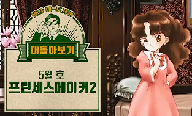](https://youtu.be/kDa_4oBuZKk?si=N666LC11y2Jfhv0b)
  
  

# [대표 이미지] 

# [<gameR makeR> 구성 요소] 

- Gamer : 1. 게이머, 2. 근성이 있는 선수 + Maker : 1. 만드는 사람, 2. 조물주
- 두 단어를 합쳐 프로게이머를 만들어 내는 게임임을 직관적으로 나타냄
- 반복되는 어감을 통하여 플레이어에게 쉽게 각인

 

## 1. 메커니즘

[도전 과제]

1. 일정 팬 및 재화 획득 시 최종 해피 엔딩 달성 (국가대표 선발)
2. 게임 진행 도중 컨디션 및 멘탈 관리 실패 시 배드 엔딩 후 새롭게 시작

[재미 요소]

1. 플레이어가 직접 스케줄을 구성하여, 컨디션 및 멘탈을 조절해나가며 공략해야함
2. 클릭을 하며

 

## 2. 이야기

[만들게 된 배경]  
- e스포츠 종목이 아시안 게임 정식 종목으로 채택되며, 금메달을 획득하여 많은 관심이 쏠린 지금, 관련된 내용을 만들고자 함
- 단순히 게임을 하는 것 뿐만 아니라 연습 경기, 체력 관리, 명성 관리 등 다양한 분야에 노력해야하는 것을 느끼게 하고자 함

[카메라 관점]  
- 원룸 배경으로, 카메라 시점 고정

 

## 3. 미적요소

[디자인][컬러]  
- 2D 도트 그래픽으로 구성
- 밝고 선명한 색감을 통하여 전반적으로 도트와 어우러지도록 아기자기한 분위기 연출
 
[음향]  
- 공통으로 사용되는 배경음악 존재
- 스케줄마다 (경기,연습,운동) 배경음악을 다르게 설정

 

## 4. 기술

Unity Engine을 사용하여 PC 및 모바일에서 플레이 할 수 있도록 개발 예정

 

# 1. 게임 오브젝트 분해 (구성 요소 분석) 

|연번|오브젝트 이름|오브젝트 이미지|
|:----:|:----:|:----:|
|1|주인공|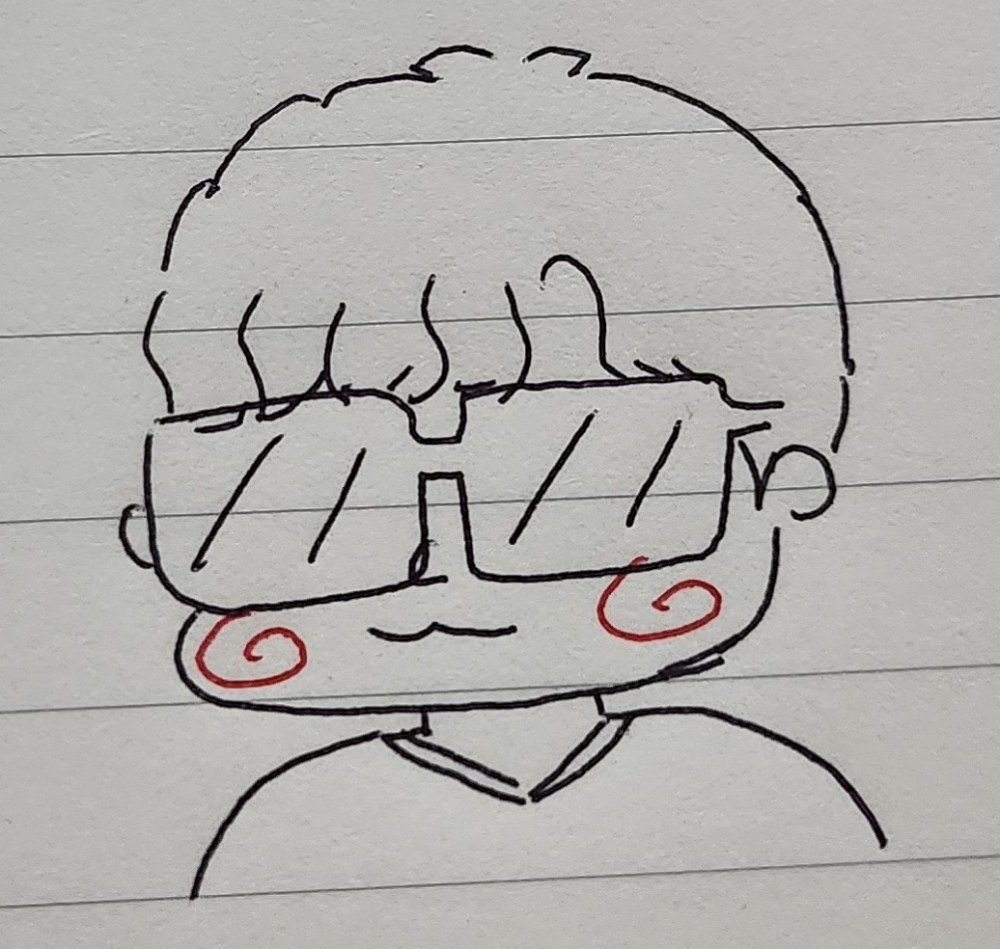|
|2|컨디션|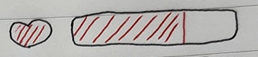|
|3|멘탈|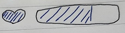|
|4|스케줄표시|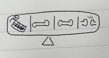|
|5|이벤트|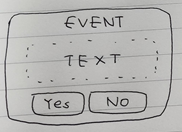|
|6|이벤트결과|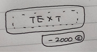|
|7|팬 수|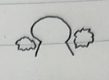|
|8|재화량||
|9|컴퓨터|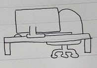|
|10|운동기구|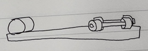|
|11|스케줄|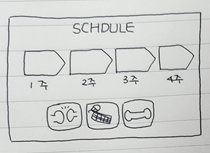|
|12|스탯|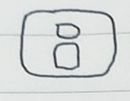|
|13|행동|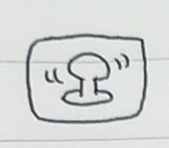|
|14|가방|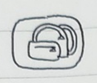|
|15|업적|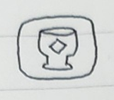|
|16|간식|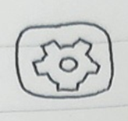|

 

# 2. 파라미터 (속성)

|속성|영문명칭|설명|
|:----:|:----:|:----:|
|1|-|-|-|
|2|-|-|-|
|3|-|-|-|
|4|-|-|-|

 

# 3. 행동

## 1. 오브젝트 이름 : PC
|행동|영문명칭|설명|
|:----:|:----:|:----:|
|1|경기|pc_match|현재 스케줄이 경기일 때 발생하는 행동|
|2|연습|pc_practice|현재 스케줄이 연습일 때 발생하는 행동|

## 2. 오브젝트 이름 : 운동기구
|행동|영문명칭|설명|
|:----:|:----:|:----:|
|1|운동|mc_health|현재 스케줄이 운동일 때 발생하는 행동|

 

# 4. 상태

## 1. 오브젝트 이름 : 스케줄 편성
|행동|영문명칭|설명|
|:----:|:----:|:----:|
|1|1주차 빈칸|경기 / 연습 / 운동 중 택1|플레이어가 스케줄 3가지 중 한가지를 선택한다|
|2|2주차 빈칸|경기 / 연습 / 운동 중 택1|플레이어가 스케줄 3가지 중 한가지를 선택한다|
|3|3주차 빈칸|경기 / 연습 / 운동 중 택1|플레이어가 스케줄 3가지 중 한가지를 선택한다|
|4|4주차 빈칸|경기 / 연습 / 운동 중 택1|플레이어가 스케줄 3가지 중 한가지를 선택한다|

## 2. 오브젝트 이름 : 상태바
|행동|영문명칭|설명|
|:----:|:----:|:----:|
|1|컨디션O|컨디션X|휴식을 하지 않고 스케줄 진행 시|
|2|멘탈O|멘탈X|명상을 하지 않고 스케줄 진행 시|

 

# 5. 플레이어 캐릭터 속성 (파라미터)
|속성|영문명칭|설명|
|:----:|:----:|:----:|
|1|경기|match|주인공이 경기에 참여한다|
|2|연습|practice|주인공이 경기에 참여한다|
|3|운동|health|주인공이 경기에 참여한다|
|4|휴식|nap|주인공이 경기에 참여한다|
|5|명상|meditation|주인공이 경기에 참여한다|

 

# [스토리보드]
  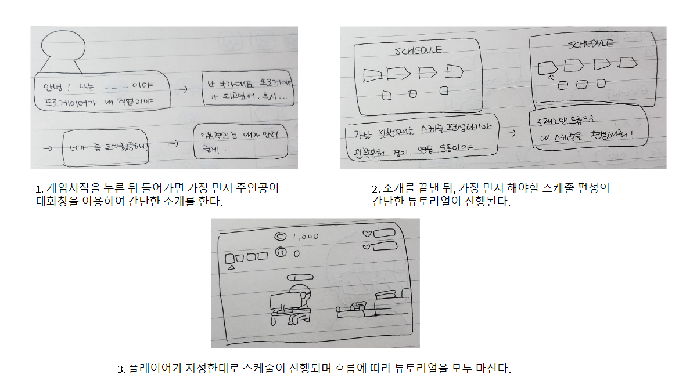

# [요구사항 (6주차)] 
  
1. 이미지 / UI 제작
   - 배경 및 캐릭터 등 이미지 제작 (2D / 클립스튜디오 사용)
   - 필요 UI 구성 및 제작

2. 타이틀 / 메인화면 제작
   - 타이틀 화면 버튼 구현
     1. 새로 시작
     2. 이어하기
     3. 크레딧 (제작자)

   - 메인화면 제작
     1. 캐릭터 정보
     2. 행동
     3. 가방
     4. 업적
     5. 설정

3. 스케줄 편성 시스템 및 날짜 표기 제작
   - 스케줄 편성 시스템
     1. 4개의 칸에 3가지의 스케줄을 드래그 앤 드랍 으로 제작 및 구현

   - 날짜 표기
      1. 일정 시간이 지날때마다 자동으로 시간이 흐름을 메인화면에 표기 (년도/월 까지 표기)

4. 재화 / 팬 / 체력 / 멘탈 바 표기 및 스케줄 편성창 제작
   - 스케줄 편성 팝업창이 표기되는 기능 구현

5. 스케줄 편성에 따른 캐릭터 행동 구현
   - 스케줄 편성 순서에 따라 캐릭터가 알맞은 행동을 보이도록 기능 구현

6. 체력 / 멘탈 / 진행도 게이지바 및 스케줄 흐름바 제작
   - 체력 / 멘탈 / 진행도를 나타내주는 게이지바 표기
   - 편성한 스케줄이 표기되면서 시간이 흐름에 따라 화살표가 이동하도록 스케줄 흐름바 표기

